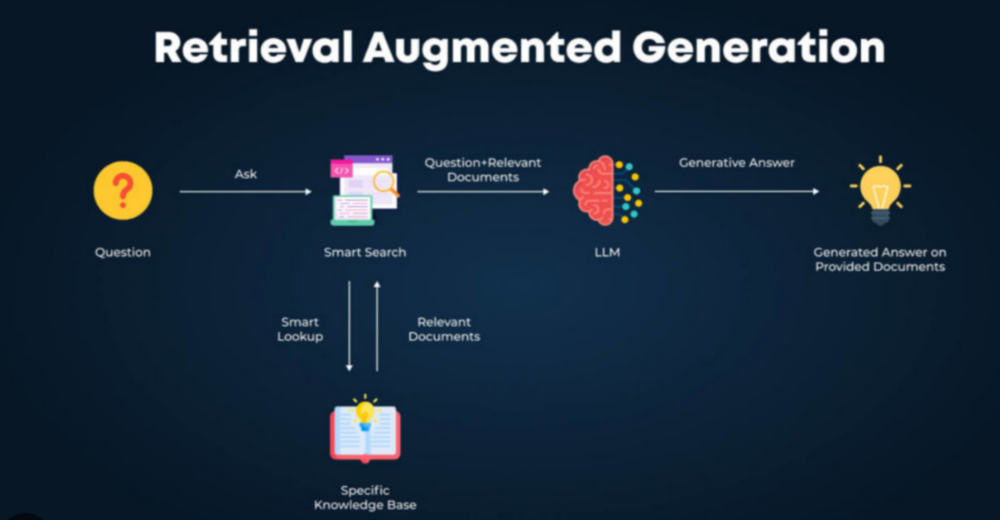

# LLM - Retrieval-Augmented Generation (RAG) AI Model





This project implements a **Retrieval-Augmented Generation (RAG) pipeline** using **LangChain**, **ChromaDB**, and **OpenAI**'s embedding & chat models. The system extracts, processes, and stores text from Word documents and enables **conversational retrieval** of stored knowledge.

## 🚀 Features

- **Extracts structured text** (paragraphs, tables) from Word documents (`.docx`).
- **Embeds and stores text** in a Chroma vector database for efficient retrieval.
- **Uses LangChain's ConversationalRetrievalChain** for chatbot-like interactions.
- **Supports multiple chunking strategies** (recursive splitting, token-based, dynamic).
- **Easily refreshable database** (delete & recreate vector storage).
- **Flexible retrieval strategies** (`stuff`, `map_reduce`, `refine`).


## 🛠 Setup

### 1️⃣ Install Dependencies
Ensure you have Python 3.8+ and install the required libraries:

```bash
pip install langchain chromadb openai python-docx python-dotenv
```


### 2️⃣ Set Up API Key

Store your OpenAI API key in a `.env` file:

```bash
OPENAI_API_KEY=your_openai_api_key
```

### 3️⃣ Organize Your Files

- Place Word documents in a `documents/` folder.
- Update paths in `lausdLLM.py` accordingly.

## 📂 Project Structure

```
📁 lausdLLM
 ┣ 📂 chromaDocs/         # ChromaDB persistent storage
 ┣ 📂 documents/          # Word documents for processing
 ┣ 📜 .env                # API keys & environment variables
 ┣ 📜 lausdLLM.py         # Main script for extraction & retrieval
 ┣ 📜 README.md           # Project documentation
```

## 🔄 Usage

### 1️⃣ Run the Extraction & Processing Pipeline

```bash
python lausdLLM.py
```

This will:

1. Extract text from `.docx` files.
2. Chunk text dynamically or using predefined strategies.
3. Embed & store data in a Chroma vector database.

### 2️⃣ Query the Knowledge Base

Once the database is set up, use the Conversational Retrieval Chain to retrieve answers:

```python
qa = load_db(word_docs, k=10, chain_type="stuff")
response = qa.run("What are the absence policies?")
print(response)
```

## 📌 Chunking Strategies

- **RecursiveCharacterTextSplitter** (default): Splits text by characters with overlap.
- **TokenTextSplitter**: Further refines based on token limits.
- **Dynamic Chunking**: Uses document structure to create meaningful sections.

## 🛠 Debugging & Customization

- **To Rebuild ChromaDB**: Set `remove=True` in `load_db()` to wipe and reinitialize the database.
- **Adjust Chunk Sizes**: Modify parameters in `chunk_documents()` and `dynamic_chunking()`.
- **Change LLM Model**: Update `ChatOpenAI(model_name="gpt-4-turbo")` as needed.

## 📌 Notes & Next Steps

- Currently optimized for **HR-related documents from SAP client requirements**.
- Future plans: **PDF support**, **better document structuring**, **improved retrieval heuristics**.

------

### 📢 Questions? Issues?

Feel free to **modify** or **extend** the code as needed! 🚀

```
This README provides a structured guide to your project, covering setup, functionality, and usage. Let me know if you want any modifications! 🚀
```